# MapToolDiceWidget

Configurable overlay widget for MapTool for rolling dice.

## Features

* Quickly select dice and modifiers and roll them.
* Customize widget location.
* Customize the available buttons.
  * Add or remove dice.
  * Use different icons, even your own.
  * Change button size.
* Use a custom macro to do the actual rolling.
* Quickly switch between included pre-defined settings.
* Position and button size are customized and saved for each user.

## Installation

Download or build (see [here](build-instructions.md)) `DiceWidget.mtlib`.

In MapTool go to `File->Add On Libraries...` Click **Add** and select `DiceWidget.mtlib`.

## How to use

The library creates an overlay in MapTool that starts as a small icon in the lower left corner of the viewport. The location of the widget can be configured to anchor to any of the four corners.

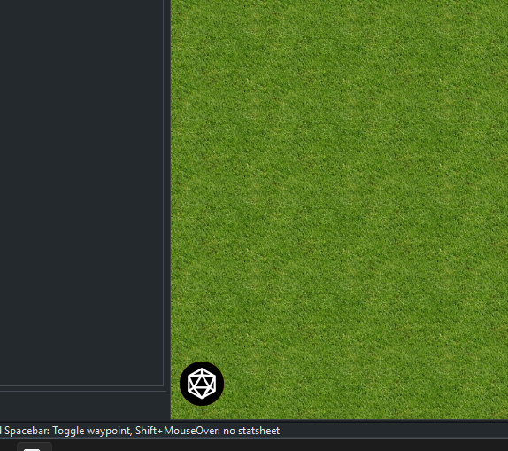

Clicking this button will pop out the whole toolbar. The following shows the default look of the toolbar which has the standard polyhedrals for D&D and the like. At this time, the toolbar will only expand vertically.

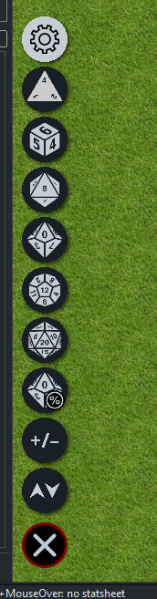

Clicking on the X button will collaps the toolbar again.

## Toolbar layout

The expanded toolbar contains 4 different parts.

1. The settings button.
2. Available Dice buttons.
3. Pseodo-dice buttons.
    1. Flat-Modifier button.
    2. Advantage/Disadvantage button.
4. Cancel/close button.

These will all be explained in more detail below.

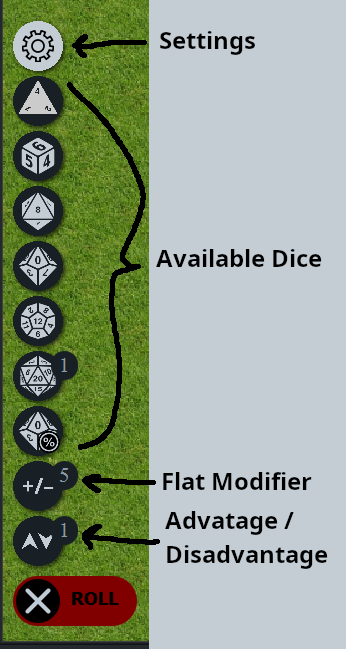

## How to roll dice

*TLDR: With an open toolbar, click on one or more of the dice or pseudo-dice buttons. Left-click adds one,
right-click removes one. Holding Control will increment by 2 instead of 1, Shift increments by 5, Ctrl+Shift
increments by 10.*

### Adding or removing dice

Left-clicking on any of the Dice buttons will add one of that die to the pool. Right-clicking will remove one of that die from the pool. Right-clicking a die while there are none of that type in the pool will instead add one "negative" die. For example, say you need the result of 1d20-1d4 (as in the Bane spell in D7D 5e). This is done by left-clicking on the d20 button, then right-clicking on the d4 button.

A small badge will show in the upper right corner of the button showing the current number of that die selected, if non-zero.

Do you need a whole buch of dice in your pool but don't want to click a million times? Don't worry! Holding Control/Command while clicking will instead increment the pool by 2 dice, holding Shift will increment by 5, and holding both Contril *and* Shift will increment by 10. For example, to get a pool of **20d6**: Hold Ctrl+Shift and left-click twice on the d6 button.

While not a default option, some die buttons may have a minium increment greater than one. In this case all the above increments are multiplied by this new minimum. [See below](#available-dice) for details.

### Adding a Flat Modifier

The first *pseudo*-die button is the Flat Modifier button. Show above with the default (+/-) icon. This is canned a pseudo-die button because it behaves just like an actual die button but does not represent a die, rather it is for specefying a flat modifier to be added or subtracted from the result. Like dice, left-clicking on the button will add one to modifier while right-clicking subtract one. Holding Control or Shift has the same affect as well.

### Specifying Advantage/Disadvantage

The second *pseudo*-die button is the Advantage/Disadvantage button. Shown above as the button with the Down/Up arrows. This is intended to represent rolling with Advantage or Disadvantage like in D&D 5e, but it can be used for other mechanics as well. See below for details on changing its behavior and a build-in example.

This button can be incremented up or down by left or right-clicking, just like dice.

By default, the built-in macro will intepret the value of this button as the number of *additional* times to roll the pool. A positive value represents advantage, and the highest result will be taken while a negative value represents disadvantage and the lowest value will be taken. If your game system treats lower values as better/advantageous, the GM can unckech the "Advantage High' checkbox in the settings.

For example, you are playing D&D 5e and need to make an attack roll of 1d20+5 with advantage. Left-Click the **d20** button once, the **Advantage/Disadvantage** button shift-click the **Flat Modifier** button once. It should look like the following:

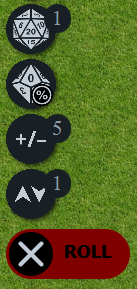

### Rolling and Canceling

Clicking the **Roll** button will roll the pool and show the results. Clicking on the X next to the **Roll** button will collapse the widget and clear any values next to the buttons.

The default macro will show the results to everyone, with the normal tooltips as if one typed the expression into the chat in `[]`. The GM will also recieve a whisper with additional details of the roll.

The attack example above would look like this when rolled (with likely different results, of course):

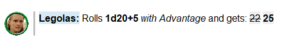

The results of each roll (~~22~~ and **25** in the example) can be hovered over to see the details.

## Customization

There are many things you can customize with this widget. Click the settings button (the gear icon) to get started. *Note: this modal window is a WIP and things are likely to change in future releases.*

### Per-User Settings

At this time, there is not much that can be customised on a per-user basis, just the position of the widget and the size and radius of the buttons. For non-GMs, these are the only options available in the settings modal.

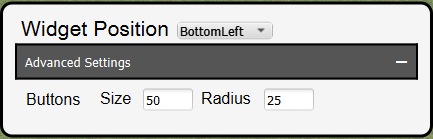

#### Widget Position

The widget can be anchored to any of the four corners of the viewport by selecting the desired corner from this drowdown.

#### Buttons

Change the size and the radius of all the buttons here. Any radius greater that half the button size has no additional affect (i.e. it's the same as if the radius was half the size). Icons should scale to fit the new size (except the Gear right now...)

### Per-Campaign Settins

GMs have access to many more options in the settings modal. Here is what that looks like when opening it for the first time:

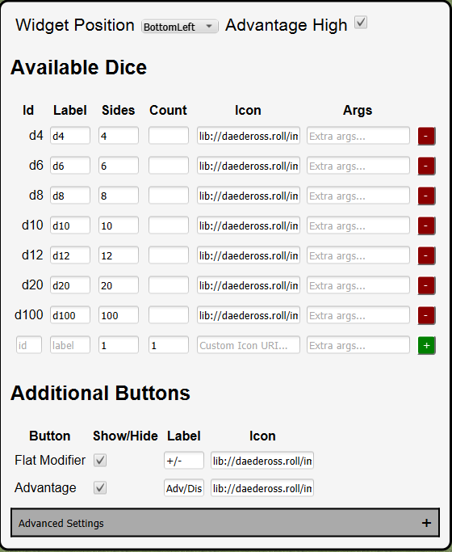

#### Available Dice

This table is where you configure what dice buttons show up in the widget and what those buttons mean. Each button has six properties:

1. Id (string): Serves no purpose other that identifying the button. It must be unique. Cannot be changed once the button is created.
2. Label (string): Text that will display as a tooltip when hovering over the button. If no icon is found, will show this text in place of the image. If blank, the widget will fallback to the Id for this.
3. Sides (number): Must be a positive integer. The number of sides per-die.
4. Count (number): The number of dice to throw per-click.
5. Icon (uri): URI for the icon button's icon. There are several built-in icons but you can use your own, as long as they are accessable via URI. See the MapTool documentation on lib URIs.
6. Args (string): For additional static args you want to pass the the macro for this die (Not used by any of the included configurations).

To add a die, input the desired values into the bottom row and press the green `+` button. All properties except the Id are optional of have a default value. You must enter a new, unique, id to add a row.

To remove a die, click the red `-` button next to the row you want to delete.

#### Additional Buttons

This is where you can configure the widget's other buttons. So far only two are available: **Flat Modifier** and **Advantage**. For each of these you can toggel them on or off and chanage their label or icon. The label and icon properties behave exactly as they do for dice buttons.

*Side note: these buttons could have been implemented as normal dice with special handling in the called macro, but developement was too far along to re-tool the macros by the time the `Args` column was added. Also needing a **Flat Modifier**, at least, is common enough in game systems that a simple checkbox to toggle it is simpler.*

#### Advanced Settings

Expanding this section will show additional options. These options (except for button size & radius) are likely to break things if you don't know what you are doing.

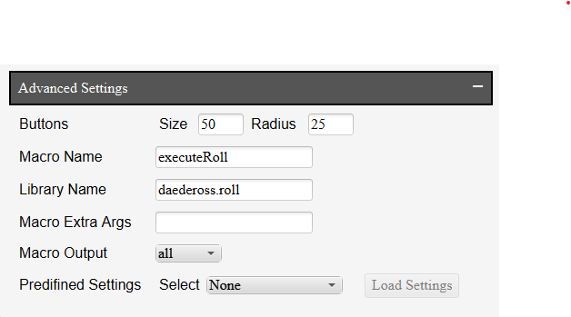

##### Macro Name and Library Name and Output

If you want to use a custom macro, these to the name of the macro and library you are using.

Behind the scenes, the macro is called by setting the href of a hidden `<a>` element then calling `.click()` on it. Here is the string construction to generate the uri: `macro://${macro_name}@lib:${lib_name}/${display}/impersonated`, where `${macro_name}`, `${lib_name}`, and `${display}` are replaced with the values of the Macro Name, Library Name, and Macro Ouput properties respectively.

##### Predefined settings

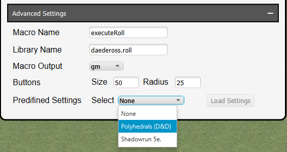

You can quickly load any of the two (as of now) predefined settings. **Caution:** you will lose any non user-specific customization you have made the the widget if loading a preset.

The first, and default setting is the standard set of polyhedrals (d4, d6, d8, d10, d12, d20, d100/d%) found in games like D&D. The second is for Shadowrun 5th Edition, which is included as an example of using a custom macro and icons for the widget.

If you load the Shadowrun 5e settings, the widget show now look like this:

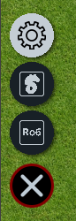

And the settings modal should now look like the following:

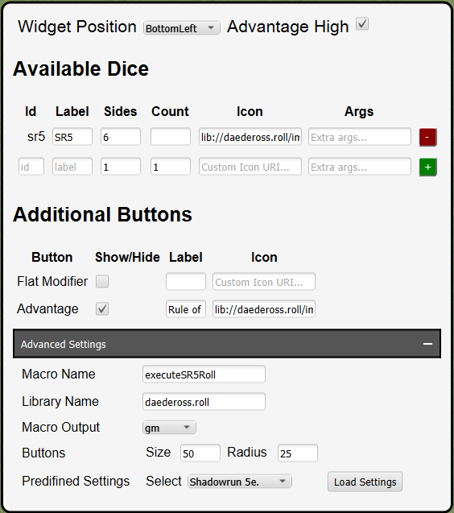

Shadowrun only uses one size die, the d6. All dice pools are composed of some number of d6s, thus there is only one die button (the S-looking logo). The other button (with the 'Ro6' logo) is a the Advantage button, this has its behavior changed from the default as explained below.

*Note: to keep it simple, I have ignored initiative (which is different than a normal roll in SR) for this example configuration.*

You will notice the Macro Name changed to `executeSR5Roll`. This macro treats the 'advantage' instead as a toggle to inidicate the roll is using the 'Rule of 6'. Under the hood, the dice function called is for the Rule of 6 is `sr5e()` instead of `sr5()`.


#### Macro API

The argument passed to the [defined macro](#macro-name-and-library-name-and-output) is a serialized plain JS object (i.e. a JSON string) that has the following structure:

```js
{
  dice: [ // Array of dice ovjects, only dice with a non-zero count are sent.
    {     // each die has the following fields:
      id: string,                     // As defined in the settings
      sides: number,                  // As defined in the settings
      count: number,                  // The number in the badge next to the die button, not from the config
      label: string | undefined,      // As defined in the settings
      icon: string | undefined,       // As defined in the settings
      expression: string | undefined, // As defined in the settings by the 'Args' column
    },
    ...
  ],
  modifier: number,     // The flat modifier selected by the user (i.e. the number next to the '+/-' button)
  advantage: number,    // The level of advantage selected by the user (the 'down/up' button)
  highIsGood: boolean,  // true if "Advantage High" is checked in the settings, otherwise false
}
```

Note about parsing the JSON: Since MapTool reads macro args from the link's query string, you need to remove the `cachelib=false ;` from `macro.args` before you can parse the JSON. The following macro line should do the trick: `[h: macroArgs = trim(decode(replace(macro.args, "cachelib=false ;", "")))]`, then just use `macroArgs` instead in your JSON parsing functions.

Now you can create your own macro to do whatever you want with this information!
